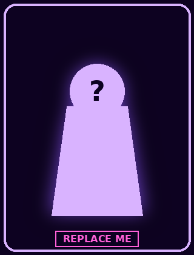
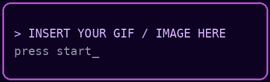

<div align="center">


<br/>


<br/><br/>

<a href="https://www.linkedin.com/in/mahesh-khadse-875172237">

</a>
<a href="https://www.youtube.com/@RaveX_Wallpapers">

</a>

</div>

<br/>

## 🎮 PLAYER HUD

<table>
<tr>
<td width="320" align="center" valign="top">

<!-- SIDE CHARACTER SLOT — swap assets/side-character.png for your own art/gif anytime -->


</td>
<td valign="top">

### 🧾 CHARACTER SHEET

| STAT | VALUE |
|---|---|
| 🪪 **Class** | Cybersecurity Analyst — SOC / VAPT |
| 🏫 **Trained At** | C-DAC Hyderabad — Advanced Security System Design |
| 📍 **Spawn Point** | Maharashtra, India |
| 🎯 **Main Quest** | Find the way in before someone else does |
| 🔗 **Network** | [Connect on LinkedIn](https://www.linkedin.com/in/mahesh-khadse-875172237) |
| 🎬 **Side Project** | Running [RaveX_Wallpapers](https://www.youtube.com/@RaveX_Wallpapers) |

`RECON` ████████████████████░░ 90%
`EXPLOITATION` ███████████████░░░░░░ 70%
`AUTOMATION` █████████████████░░░░ 80%
`CREATIVITY` ████████████████████░ 95%

</td>
</tr>
</table>

<!-- START-UP SCREEN SLOT — swap assets/start-box.gif for your own banner/gif anytime -->
<div align="center">

</div>

<br/>

<details>
<summary>📜 <b>CLICK TO OPEN QUEST LOG</b></summary>
<br/>

```diff
+ [COMPLETED] Advanced Security System Design — C-DAC Hyderabad
+ [ACTIVE]    Hunting misconfigurations & vulnerabilities in the wild
+ [ACTIVE]    Building offensive/defensive tooling from scratch
+ [ONGOING]   Uploading looping visuals to RaveX_Wallpapers
! [UNLOCKED]  "Reads syscalls for fun" achievement
```

</details>

<details>
<summary>🎒 <b>CLICK TO OPEN INVENTORY</b></summary>
<br/>

<div align="center">

</div>

</details>

<details>
<summary>🕹️ <b>CLICK TO VIEW BOSS FIGHTS (PROJECTS)</b></summary>
<br/>

<div align="center">

**⚔️ Real-Time Linux System Call Tracer**
Watches every syscall a process makes — real time, no blind spots.
[View repo →](https://github.com/MaheshK006/Real-Time-Dynamic-Linux-System-Call-Tracer)

**⚔️ RaveX Live Wallpaper Loop Maker**
Turns any clip into a seamless multi-hour looping wallpaper.
[View repo →](https://github.com/MaheshK006/RaveX_Live-Wallpaper-Loop-Maker)

**⚔️ Sentiment Analysis & Recommendation System**
ML/NLP engine that reads movie reviews and predicts sentiment.
[View repo →](https://github.com/MaheshK006/Sentiment-Analysis-of-Movie-Reviews-and-Recommendations-System1)

</div>

</details>

<br/>

## 🏆 ACHIEVEMENTS

<div align="center">

| STATUS | ACHIEVEMENT |
|:---:|---|
| 🔓 | **Certified Operative** — Completed Advanced Security System Design, C-DAC Hyderabad |
| 🔓 | **System Whisperer** — Built a real-time Linux syscall tracer from scratch |
| 🔓 | **Loop Master** — Automated 3-hour seamless video loops for YouTube |
| 🔓 | **Data Reader** — Built an ML sentiment analysis & recommendation engine |
| 🔒 | **??? — locked, keep pushing commits to find out** |
| 🔒 | **??? — locked, keep pushing commits to find out** |

</div>

## 📊 PLAYER STATS

<div align="center">


</div>

## 🐍 THE GRIND (contribution snake)

<div align="center">


<sub>(needs the one-time GitHub Action setup)</sub>
</div>

<br/>

<div align="center">
<sub>💾 SAVE STATE COMMITTED — see you at the next commit.</sub>
</div>

## 🖥️ TERMINAL ART

<details>
<summary>💾 <b>CLICK TO RENDER ASCII BUFFER</b></summary>
<br/>

<div align="center">
```
  ⠀⠀⠀⠀⠀⠀⠀⠀⠀⠀⠀⠀⠀⠀⠀⠀⠀⠀⠀⠀⠀⠀⠀⠀⠀⠀⠀⠀⠀⠀⠀⠀⠀⠀⠀⠀⠀⠀⠀⠀⣠⠯⠇⠀⠀⠀⠀⠀⠀⠀⠀⠀⠀⠀⠀⠀⠀⠀⠀⠀⠀⠀⠀⠀⠀⠀⠀⠀⠀⠈⠬⢡⠀⠀⠀⠀⠀⠀⠀⠀⠀⠀⠀⠀⠀⠀⠀⠀⠀⠀⠀⠀⠀⠀⠀⠀⠀⠀⠀⠀⠀⠀⠀⠀⠀⠀⠀⠀⠀
⠀⠀⠀⠀⠀⠀⠀⠀⠀⠀⠀⠀⠀⠀⠀⠀⠀⠀⠀⠀⠀⠀⠀⠀⠀⠀⠀⠀⠀⠀⠀⠀⠀⠀⠀⠀⠀⠀⢀⣰⣋⠃⠀⠀⠀⠀⠀⠀⠀⠀⠀⠀⠀⠀⠀⠀⠀⠀⠀⠀⠀⠀⠀⠀⠀⠀⠀⠀⠀⠈⠠⢐⢒⠀⠀⠀⠀⠀⠀⠀⠀⠀⠀⠀⠀⠀⠀⠀⠀⠀⠀⠀⠀⠀⠀⠀⠀⠀⠀⠀⠀⠀⠀⠀⠀⠀⠀⠀⠀
⠀⠀⠀⠀⠀⠀⠀⠀⠀⠀⠀⠀⠀⠀⠀⠀⠀⠀⠀⠀⠀⠀⠀⠀⠀⠀⠀⠀⠀⠀⠀⠀⠀⠀⠀⠀⠀⢀⡢⡯⠄⠀⠀⠀⠀⠀⠀⠀⠀⠀⠀⠀⠀⠀⠀⠀⠀⠀⠀⠀⠀⠀⠀⠀⠀⠀⠀⠀⠀⠀⠀⠄⠡⢴⠀⠀⠀⠀⠀⠀⠀⠀⠀⠀⠀⠀⠀⠀⠀⠀⠀⠀⠀⠀⠀⠀⠀⠀⠀⠀⠀⠀⠀⠀⠀⠀⠀⠀⠀
⠀⠀⠀⠀⠀⠀⠀⠀⠀⠀⠀⠀⠀⠀⠀⠀⠀⠀⠀⠀⠀⠀⠀⠀⠀⠀⠀⠀⠀⠀⠀⠀⠀⠀⠀⠀⢀⢢⡝⠑⠀⠀⠀⠀⠀⠀⠀⠀⠀⠀⠀⠀⠀⠀⠀⠀⠀⠀⠀⠀⠀⠀⠀⠀⠀⠀⠀⠀⠀⠀⠀⠀⢁⠐⣱⠀⠀⠀⠀⠀⠀⠀⠀⠀⠀⠀⠀⠀⠀⠀⠀⠀⠀⠀⠀⠀⠀⠀⠀⠀⠀⠀⠀⠀⠀⠀⠀⠀⠀
⠀⠀⠀⠀⠀⠀⠀⠀⠀⠀⠀⠀⠀⠀⠀⠀⠀⠀⠀⠀⠀⠀⠀⠀⠀⠀⠀⠀⠀⠀⠀⠀⠀⠀⠀⠀⣢⠾⠈⠀⠀⠀⠀⠀⠀⠀⠀⠀⠀⠀⠀⠀⠀⠀⠀⠀⠀⠀⠀⠀⠀⠀⠀⠀⠀⠀⠀⠀⠀⠀⠀⠀⠀⠂⠸⡅⠀⠀⠀⠀⠀⠀⠀⠀⠀⠀⠀⠀⠀⠀⠀⠀⠀⠀⠀⠀⠀⠀⠀⠀⠀⠀⠀⠀⠀⠀⠀⠀⠀
⠀⠀⠀⠀⠀⠀⠀⠀⠀⠀⠀⠀⠀⠀⠀⠀⠀⠀⠀⠀⠀⠀⠀⠀⠀⠀⠀⠀⠀⠀⠀⠀⠀⠀⢀⢒⣭⡁⠀⠀⠀⠀⠀⠀⠀⠀⠀⠀⠀⠠⠀⠀⠀⠀⠀⠀⠀⠀⡀⡀⠄⠀⠀⠀⠀⠀⠀⠀⠀⠀⠀⠀⠀⠐⡀⢪⢂⡄⠀⠀⠀⠀⠀⠀⠀⠀⠀⠀⠀⠀⠀⠀⠀⠀⠀⠀⠀⠀⠀⠀⠀⠀⠀⠀⠀⠀⠀⠀⠀
⠀⠀⠀⠀⠀⠀⠀⠀⠀⠀⠀⠀⠀⠀⠀⠀⠀⠀⠀⠀⠀⠀⠀⠀⠀⠀⠀⠀⠀⠀⠀⠀⠀⠀⢢⣷⡸⡠⠄⠀⠀⠀⠀⠀⠀⠀⠀⠀⠠⠁⠀⠀⠀⢀⠠⡐⠌⠂⠁⠀⠀⠀⠀⠀⠀⠀⠀⠀⠀⠀⠀⠀⠀⠀⢴⣫⠵⡠⠀⠀⠀⠀⠀⠀⠀⠀⠀⠀⠀⠀⠀⠀⠀⠀⠀⠀⠀⠀⠀⠀⠀⠀⠀⠀⠀⠀⠀⠀⠀
⠀⠀⠀⠀⠀⠀⠀⠀⠀⠀⠀⠀⠀⠀⠀⠀⠀⠀⠀⠀⠀⠀⠀⠀⠀⠀⠀⠀⠀⠀⠀⠀⠀⢌⡿⣮⢭⠑⠀⠀⠀⠀⠀⠀⠀⡀⡀⠄⠀⡀⠀⠀⢄⠢⠑⡈⢀⢂⡀⠃⠌⠠⢀⠀⠀⠀⠀⠀⠀⠀⠀⠀⠀⠈⢄⣳⡛⡐⡂⠀⠀⠀⠀⠀⠀⠀⠀⠀⠀⠀⠀⠀⠀⠀⠀⠀⠀⠀⠀⠀⠀⠀⠀⠀⠀⠀⠀⠀⠀
⠀⠀⠀⠀⠀⠀⠀⠀⠀⠀⠀⠀⠀⠀⠀⠀⠀⠀⠀⠀⠀⠀⠀⠀⠀⠀⠀⠀⠀⠀⠀⠀⢐⣺⣽⠲⠆⠀⠀⠀⠀⠀⠀⠄⠢⢑⡈⠆⠡⠀⠠⡘⢄⠣⠑⠈⠂⢂⠔⡩⢐⠡⢂⠄⡀⠀⠀⠀⠀⠀⠀⠀⠀⠀⢀⠲⠽⡥⠧⠀⠀⠀⠀⠀⠀⠀⠀⠀⠀⠀⠀⠀⠀⠀⠀⠀⠀⠀⠀⠀⠀⠀⠀⠀⠀⠀⠀⠀⠀
⠀⠀⠀⠀⠀⠀⠀⠀⠀⠀⠀⠀⠀⠀⠀⠀⠀⠀⠀⠀⠀⠀⠀⠀⠀⠀⠀⠀⠀⠀⢀⣰⣎⣷⣫⣩⠅⠀⠀⢀⠀⡀⢃⠘⡀⢂⠠⠃⠄⢠⠑⡌⠂⠒⡄⢣⠐⢢⠐⡄⢂⠆⡡⢈⠄⡁⠂⡄⢀⠀⠀⠀⠀⠀⠀⢈⣙⣞⣱⢣⣀⡄⠀⠀⠀⠀⠀⠀⠀⠀⠀⠀⠀⠀⠀⠀⠀⠀⠀⠀⠀⠀⠀⠀⠀⠀⠀⠀⠀
⠀⠀⠀⠀⠀⠀⠀⠀⠀⠀⠀⠀⠀⠀⠀⠀⠀⠀⠀⠀⠀⠀⠀⠀⠀⠀⠀⠀⠀⠀⠾⢳⡟⡼⠖⠁⠀⠀⠁⢄⠂⡔⠠⠂⢈⠀⠁⠒⣈⠠⢃⠌⡈⠒⠈⠀⠍⢢⠑⡌⠒⣌⠰⡁⠎⡄⡁⠈⠂⠘⠤⢁⠂⠄⠢⠄⠠⣉⣈⣁⡀⠤⠈⠀⠀⠀⠀⠀⠀⠀⠀⠀⠀⠀⠀⠀⠀⠀⠀⠀⠀⠀⠀⠀⠀⠀⠀⠀⠀
⠀⠀⠀⠀⠀⠀⠀⠀⠀⠀⠀⠀⠀⠀⠀⠀⠀⠀⠀⠀⠀⠀⠀⠀⠀⠀⠀⠀⠀⠀⠀⠀⠠⠁⠀⠀⠀⢠⠑⢈⠄⡂⢆⡉⢆⠸⢠⠀⠀⠱⡈⠄⠀⠀⠀⠀⠀⠁⠎⡰⠉⡄⢣⠘⠤⡑⡰⢀⠀⠀⠀⠀⠀⠈⠀⠀⠄⠀⠁⠀⠀⠀⠀⠀⠀⠀⠀⠀⠀⠀⠀⠀⠀⠀⠀⠀⠀⠀⠀⠀⠀⠀⠀⠀⠀⠀⠀⠀⠀
⠀⠀⠀⠀⠀⠀⠀⠀⠀⠀⠀⠀⠀⠀⠀⠀⠀⠀⠀⠀⠀⠀⠀⠀⠀⠀⠀⠀⠀⠀⠀⠀⠀⠀⠀⠀⡌⢢⠘⡄⢊⠔⠢⠜⡨⢌⠡⠒⠄⠰⠡⠀⡀⠄⠀⠀⠀⠀⠀⢁⠣⠈⢆⠩⢆⠑⠠⠃⢆⠀⠀⠀⠀⠀⠀⠀⠀⠀⠁⠀⠀⠀⠀⠀⠀⠀⠀⠀⠀⠀⠀⠀⠀⠀⠀⠀⠀⠀⠀⠀⠀⠀⠀⠀⠀⠀⠀⠀⠀
⠀⠀⠀⠀⠀⠀⠀⠀⠀⠀⠀⠀⠀⠀⠀⠀⠀⠀⠀⠀⠀⠀⠀⠀⠀⠀⠀⠀⠀⠀⠀⠀⠀⠀⡄⢱⠈⡆⠑⢠⠁⡎⠑⠊⡄⠀⢠⠀⡄⢠⢣⠘⣤⠐⠂⠒⠀⠀⠀⠀⢡⠃⠈⢱⢨⡌⢱⠀⠈⠀⠀⠀⠀⠀⠀⠀⠀⠀⠀⠀⠀⠀⠀⠀⠀⠀⠀⠀⠀⠀⠀⠀⠀⠀⠀⠀⠀⠀⠀⠀⠀⠀⠀⠀⠀⠀⠀⠀⠀
⠀⠀⠀⠀⠀⠀⠀⠀⠀⠀⠀⠀⠀⠀⠀⠀⠀⠀⠀⠀⠀⠀⠀⠀⠀⠀⠀⠀⠀⠀⠀⠀⠀⡐⠌⡂⠅⠀⡐⢌⠢⡅⠋⡐⠀⠀⠀⢀⣀⣀⣬⣥⣶⣯⣵⣶⣶⣶⣶⣤⣄⠊⡄⠀⠀⠊⠠⠃⠆⣀⠀⠀⠀⠀⠀⠀⠀⠀⠀⠀⠀⠀⠀⠀⠀⠀⠀⠀⠀⠀⠀⠀⠀⠀⠀⠀⠀⠀⠀⠀⠀⠀⠀⠀⠀⠀⠀⠀⠀
⠀⠀⠀⠀⠀⠀⠀⠀⠀⠀⠀⠀⠀⠀⠀⠀⠀⠀⠀⠀⠀⠀⠀⠀⠀⠀⠀⠀⠀⠀⠀⠀⠀⠂⠁⠀⢀⠢⡑⢌⠂⠀⠐⢀⡤⠐⣾⣿⣟⣿⣻⣽⣯⣟⣯⣿⡽⣯⣿⣽⣻⢷⡀⡀⢀⡀⠀⠀⠀⠀⠀⠀⠀⠀⠀⠀⠀⠀⠀⠀⠀⠀⠀⠀⠀⠀⠀⠀⠀⠀⠀⠀⠀⠀⠀⠀⠀⠀⠀⠀⠀⠀⠀⠀⠀⠀⠀⠀⠀
⠀⠀⠀⠀⠀⠀⠀⠀⠀⠀⠀⠀⠀⠀⠀⠀⠀⠀⠀⠀⠀⠀⠀⠀⠀⠀⠀⠀⠀⠀⠀⠀⠀⢀⢀⠀⢆⠱⡈⠆⢀⡠⡘⣼⠃⢹⣿⣳⣿⣽⣯⣷⢿⣽⣻⣞⣿⡽⣷⣻⣯⡿⣿⣦⡀⠙⢷⣦⠀⠀⠀⠀⠀⠀⠀⠀⠀⠀⠀⠀⠀⠀⠀⠀⠀⠀⠀⠀⠀⠀⠀⠀⠀⠀⠀⠀⠀⠀⠀⠀⠀⠀⠀⠀⠀⠀⠀⠀⠀
⠀⠀⠀⠀⠀⠀⠀⠀⠀⠀⠀⠀⠀⠀⠀⠀⠀⠀⠀⠀⠀⠀⠀⠀⠀⠀⠀⠀⠀⠀⠀⠀⡈⠆⢂⡉⢆⠑⢈⣶⣿⡇⠀⡟⠈⣿⣿⢯⣷⢿⣾⣻⣯⡿⣯⣿⡽⣟⣿⣳⡿⣽⡷⣿⣻⣦⣀⠉⠠⠐⠀⠀⠀⠀⠀⠀⠀⠀⠀⠀⠀⠀⠀⠀⠀⠀⠀⠀⠀⠀⠀⠀⠀⠀⠀⠀⠀⠀⠀⠀⠀⠀⠀⠀⠀⠀⠀⠀⠀
⠀⠀⠀⠀⠀⠀⠀⠀⠀⠀⠀⠀⠀⠀⠀⠀⠀⠀⠀⠀⠀⠀⠀⠀⠀⠀⠀⠀⠀⠀⠀⠀⡰⢁⠆⠘⠀⢀⣼⣿⣞⡇⠀⡧⢹⣿⢯⣿⢯⣿⡷⣿⣳⣿⣟⣷⣿⣻⣽⢿⣽⡿⣽⣿⣽⣻⡿⢀⠀⠀⠈⠀⠀⠀⠀⠀⠀⠀⠀⠀⠀⠀⠀⠀⠀⠀⠀⠀⠀⠀⠀⠀⠀⠀⠀⠀⠀⠀⠀⠀⠀⠀⠀⠀⠀⠀⠀⠀⠀
⠀⠀⠀⠀⠀⠀⠀⠀⠀⠀⠀⠀⠀⠀⠀⠀⠀⠀⠀⠀⠀⠀⠀⠀⠀⠀⠀⠀⠀⠀⠀⠠⡑⠌⠀⠀⢀⣾⠋⠈⠀⠀⡁⠀⠀⠀⠀⠈⠉⠉⠙⣯⡿⣷⣻⣽⣾⡻⠙⠉⠀⠀⠀⠀⠀⠀⠀⠀⠀⠀⠀⠠⠀⠀⠀⠀⠀⠀⠀⠀⠀⠀⠀⠀⠀⠀⠀⠀⠀⠀⠀⠀⠀⠀⠀⠀⠀⠀⠀⠀⠀⠀⠀⠀⠀⠀⠀⠀⠀
⠀⠀⠀⠀⠀⠀⠀⠀⠀⠀⠀⠀⠀⠀⠀⠀⠀⠀⠀⠀⠀⠀⠀⠀⠀⠀⠀⠀⠀⠀⢀⠁⠜⠀⠀⠀⢸⢃⣴⣾⣿⢿⡀⠇⡴⠶⢒⢀⡀⢀⣈⣼⣿⣻⣽⣷⣻⠗⢀⡀⢄⣀⡂⠀⠔⠠⢂⠔⡀⠆⡀⠄⠀⠀⠀⠀⠀⠀⠀⠀⠀⠀⠀⠀⠀⠀⠀⠀⠀⠀⠀⠀⠀⠀⠀⠀⠀⠀⠀⠀⠀⠀⠀⠀⠀⠀⠀⠀⠀
⠀⠀⠀⠀⠀⠀⠀⠀⠀⠀⠀⠀⠀⠀⠀⠀⠀⠀⠀⠀⠀⠀⠀⠀⠀⠀⠀⠀⠀⠀⠄⠀⠊⢀⠂⠀⣰⣿⣻⢞⣙⣭⣵⡰⠘⣿⣻⣶⣮⣴⣸⣿⣳⣿⣳⣟⠏⣐⣦⣵⣿⣟⣧⠡⠈⠔⡀⠂⠄⡐⠠⠀⠀⠀⠀⠀⠀⠀⠀⠀⠀⠀⠀⠀⠀⠀⠀⠀⠀⠀⠀⠀⠀⠀⠀⠀⠀⠀⠀⠀⠀⠀⠀⠀⠀⠀⠀⠀⠀
⠀⠀⠀⠀⠀⠀⠀⠀⠀⠀⠀⠀⠀⠀⠀⠀⠀⠀⠀⠀⠀⠀⠀⠀⠀⠀⠀⠀⠀⠈⠀⠀⠠⠃⠀⠀⣿⣧⡴⠟⠛⢉⡈⠁⠀⡀⠀⠀⠤⣉⣷⡿⣯⣷⣿⣁⣾⣿⣻⣉⡄⠄⠀⠀⠀⠀⠀⠁⠐⠀⠂⠌⠀⠀⠀⠀⠀⠀⠀⠀⠀⠀⠀⠀⠀⠀⠀⠀⠀⠀⠀⠀⠀⠀⠀⠀⠀⠀⠀⠀⠀⠀⠀⠀⠀⠀⠀⠀⠀
⠀⠀⠀⠀⠀⠀⠀⠀⠀⠀⠀⠀⠀⠀⠀⠀⠀⠀⠀⠀⠀⠀⠀⠀⠀⠀⠀⠀⠀⠀⠀⠀⠀⠡⠀⠀⣿⣥⣶⣬⣩⣭⣷⣶⣶⡝⢿⡿⣿⣟⣯⣿⢷⣟⣾⢻⣽⡾⣟⣿⢿⣻⠄⢂⠄⡄⠀⢄⠠⠀⠠⠀⠌⡀⠀⠀⠀⠀⠀⠀⠀⠀⠀⠀⠀⠀⠀⠀⠀⠀⠀⠀⠀⠀⠀⠀⠀⠀⠀⠀⠀⠀⠀⠀⠀⠀⠀⠀⠀
⠀⠀⠀⠀⠀⠀⠀⠀⠀⠀⠀⠀⠀⠀⠀⠀⠀⠀⠀⠀⠀⠀⠀⠀⠀⠀⠀⠀⠀⠀⠀⠀⢠⡀⢁⠀⢿⡿⣽⣯⣷⢿⣳⡿⣾⣟⡷⣿⣳⣿⣻⣾⣟⣯⣿⠘⣉⠻⣯⣿⣻⣯⣿⡿⣿⣶⠏⢄⠢⠑⠤⢉⠐⡀⠀⠀⠀⠀⠀⠀⠀⠀⠀⠀⠀⠀⠀⠀⠀⠀⠀⠀⠀⠀⠀⠀⠀⠀⠀⠀⠀⠀⠀⠀⠀⠀⠀⠀⠀
⠀⠀⠀⠀⠀⠀⠀⠀⠀⠀⠀⠀⠀⠀⠀⠀⠀⠀⠀⠀⠀⠀⠀⠀⠀⠀⠀⠀⠀⠀⠀⠀⡜⠈⢦⠀⢸⣿⣟⣷⣿⣻⣯⢿⣷⢿⣻⡿⣽⡷⣿⣳⣿⣻⣾⠈⡔⢣⠌⣳⡿⣷⡿⡽⢋⠄⡒⢨⠐⣉⠰⢈⠐⠀⠀⠀⢀⠀⠀⠀⠀⠀⠀⠀⠀⠀⠀⠀⠀⠀⠀⠀⠀⠀⠀⠀⠀⠀⠀⠀⠀⠀⠀⠀⠀⠀⠀⠀⠀
⠀⠀⠀⠀⠀⠀⠀⠀⠀⠀⠀⠀⠀⠀⠀⠀⠀⠀⠀⠀⠀⠀⠀⠀⠀⠀⠀⠀⠀⠀⠀⠀⡇⣇⢊⢧⢸⣿⢾⣟⣾⣯⣟⣿⡾⣟⣿⣽⡿⣽⡿⣽⣾⣟⣷⡆⠍⢦⢉⡔⢹⡿⠋⡄⢣⠘⠤⠡⢌⠠⢂⠡⠌⠀⢀⠆⢠⠀⠀⠀⠀⠀⠀⠀⠀⠀⠀⠀⠀⠀⠀⠀⠀⠀⠀⠀⠀⠀⠀⠀⠀⠀⠀⠀⠀⠀⠀⠀⠀
⠀⠀⠀⠀⠀⠀⠀⠀⠀⠀⠀⠀⠀⠀⠀⠀⠀⠀⠀⠀⠀⠀⠀⠀⠀⠀⠀⠀⠀⠀⠀⠀⣷⣿⡈⢸⡄⣿⣟⣯⣷⣟⣯⣷⢿⣟⡿⣞⣿⢿⣽⣟⣷⢿⣯⠁⡉⢆⢊⠤⢋⠰⡈⠔⣁⠊⡔⢁⠢⢁⢊⠐⡈⠰⠈⢀⠂⠄⠀⠀⠀⠀⠀⠀⠀⠀⠀⠀⠀⠀⠀⠀⠀⠀⠀⠀⠀⠀⠀⠀⠀⠀⠀⠀⠀⠀⠀⠀⠀
⠀⠀⠀⠀⠀⠀⠀⠀⠀⠀⠀⠀⠀⠀⠀⠀⠀⠀⠀⠀⠀⠀⠀⠀⠀⠀⠀⠀⠀⠀⠀⠀⠩⢗⠓⡘⢿⣟⣾⣯⣷⢿⣻⣾⢿⣯⣿⣟⣯⣿⣻⣾⣟⡿⣏⡐⢌⢢⠡⢊⠄⢣⠘⡰⢀⠣⠐⡌⠄⢃⠄⠃⠄⠁⡀⠂⠈⠀⠀⠀⠀⠀⠀⠀⠀⠀⠀⠀⠀⠀⠀⠀⠀⠀⠀⠀⠀⠀⠀⠀⠀⠀⠀⠀⠀⠀⠀⠀⠀
⠀⠀⠀⠀⠀⠀⠀⠀⠀⠀⠀⠀⠀⠀⠀⠀⠀⠀⠀⠀⠀⠀⠀⠀⠀⠀⠀⠀⠀⠀⠀⠐⠀⠱⣘⠔⡊⣿⣽⣾⢯⣿⢿⣽⣯⣷⢿⣾⣻⡷⣿⣳⣿⠻⣿⢷⣌⠢⡑⢌⡘⠤⠑⡠⢁⠆⡡⠐⠌⢂⠌⢠⠃⠰⠁⡐⠀⠀⠀⠀⠀⠀⠀⠀⠀⠀⠀⠀⠀⠀⠀⠀⠀⠀⠀⠀⠀⠀⠀⠀⠀⠀⠀⠀⠀⠀⠀⠀⠀
⠀⠀⠀⠀⠀⠀⠀⠀⠀⠀⠀⠀⠀⠀⠀⠀⠀⠀⠀⠀⠀⠀⠀⠀⠀⠀⠀⠀⠀⠀⠀⠂⠀⠄⠘⢿⣶⡸⣯⣿⣻⣽⣿⣳⡿⣽⣿⣳⡿⣽⡟⠇⠀⠤⣀⠈⠉⠓⠬⠐⡄⢊⠔⡁⢂⠆⢡⠘⡈⠤⢈⠂⢠⡐⠈⠀⠀⠀⠀⠀⠀⠀⠀⠀⠀⠀⠀⠀⠀⠀⠀⠀⠀⠀⠀⠀⠀⠀⠀⠀⠀⠀⠀⠀⠀⠀⠀⠀⠀
⠀⠀⠀⠀⠀⠀⠀⠀⠀⠀⠀⠀⠀⠀⠀⠀⠀⠀⠀⠀⠀⠀⠀⠀⠀⠀⠀⠀⠀⠀⠠⠐⠈⠀⠄⡀⢀⠀⢻⣷⣟⣷⡿⣽⣟⣿⢾⡿⠉⣠⡶⢛⣛⡶⠶⣶⣥⣤⣤⣀⣀⡁⠒⠈⠤⠘⠀⢆⠁⢂⠌⠀⠀⠀⠀⠀⠀⠀⠀⠀⠀⠀⠀⠀⠀⠀⠀⠀⠀⠀⠀⠀⠀⠀⠀⠀⠀⠀⠀⠀⠀⠀⠀⠀⠀⠀⠀⠀⠀
⠀⠀⠀⠀⠀⠀⠀⠀⠀⠀⠀⠀⠀⠀⠀⠀⠀⠀⠀⠀⠀⠀⠀⠀⠀⠀⠀⠀⠀⠀⠄⠀⠠⠁⡐⢀⠂⠌⠠⠹⣾⣯⣿⢯⣿⢾⣟⣇⠐⡟⣰⣿⡿⣷⣦⣤⣈⣉⠉⠛⠋⠛⠿⠿⠟⢷⣶⠀⠌⠌⠀⠀⠀⠀⠀⠀⠀⠀⠀⠀⠀⠀⠀⠀⠀⠀⠀⠀⠀⠀⠀⠀⠀⠀⠀⠀⠀⠀⠀⠀⠀⠀⠀⠀⠀⠀⠀⠀⠀
⠀⠀⠀⠀⠀⠀⠀⠀⠀⠀⠀⠀⠀⠀⠀⠀⠀⠀⠀⠀⠀⠀⠀⠀⠀⠀⠀⠄⠈⠀⡀⠈⢀⠐⠀⠄⡈⠄⠃⠄⠈⢿⣽⡿⣯⣿⡯⠿⡀⢣⣿⡯⢛⣛⣛⡙⠛⢋⠛⠓⠒⠒⠲⠶⢶⣷⠈⠁⠎⠀⠀⠀⠀⠀⠀⠀⠀⠀⠀⠀⠀⠀⠀⠀⠀⠀⠀⠀⠀⠀⠀⠀⠀⠀⠀⠀⠀⠀⠀⠀⠀⠀⠀⠀⠀⠀⠀⠀⠀
⠀⠀⠀⠀⠀⠀⠀⠀⠀⠀⠀⠀⠀⠀⠀⠀⠀⠀⠀⠀⠀⠀⠀⠀⠀⠐⠀⠀⡐⠀⢀⠐⠠⢀⠁⢂⠐⡈⠌⡐⠠⢰⣝⢿⣟⣷⠠⣶⢀⡿⢃⣴⣿⢯⣟⣿⡿⣿⡿⣿⣿⣿⣿⢿⡿⠂⡀⢠⠀⠀⠀⠀⠀⠀⠀⠀⠀⠀⠀⠀⠀⠀⠀⠀⠀⠀⠀⠀⠀⠀⠀⠀⠀⠀⠀⠀⠀⠀⠀⠀⠀⠀⠀⠀⠀⠀⠀⠀⠀
⠀⠀⠀⠀⠀⠀⠀⠀⠀⠀⠀⠀⠀⠀⠀⠀⠀⠀⠀⠀⠀⠀⠀⢀⠈⠀⡀⠁⢀⠐⠀⠄⠂⠄⡈⠄⢂⠐⢀⣤⠁⢸⣯⣷⣌⠻⢸⡏⠈⣴⣿⣻⣞⡛⠯⠷⠿⠯⠿⠷⠟⠾⠏⠋⡀⢄⡁⢠⠠⢤⣀⠀⠀⠀⠀⠀⠀⠀⠀⠀⠀⠀⠀⠀⠀⠀⠀⠀⠀⠀⠀⠀⠀⠀⠀⠀⠀⠀⠀⠀⠀⠀⠀⠀⠀⠀⠀⠀⠀
⠀⠀⠀⠀⠀⠀⠀⠀⠀⠀⠀⠀⠀⠀⠀⠀⠀⠀⠀⠀⠀⠀⠠⠀⢀⠐⠀⡈⠠⠐⡈⠐⡈⠐⢠⠈⠄⣴⡿⢁⡐⢸⣿⣳⣿⡇⣼⠧⣾⣟⡷⠟⠉⠁⡠⢄⠤⠠⢄⠀⠀⡀⠄⡐⠠⠰⡀⠠⢘⠠⢈⠳⣄⠀⠀⠀⠀⠀⠀⠀⠀⠀⠀⠀⠀⠀⠀⠀⠀⠀⠀⠀⠀⠀⠀⠀⠀⠀⠀⠀⠀⠀⠀⠀⠀⠀⠀⠀⠀
⠀⠀⠀⠀⠀⠀⠀⠀⠀⠀⠀⠀⠀⠀⠀⠀⠀⠀⠀⠀⠀⠐⠀⡀⠂⡀⠂⠄⡁⠂⢄⠡⠐⡉⠄⢨⣾⡿⠁⠤⣐⠸⠿⠿⠳⠧⠘⡇⣿⣻⡄⢠⠰⣉⣶⣮⢌⡓⠬⡀⠀⡐⠀⠆⡁⢢⠁⠂⢨⢃⠄⢂⠌⠣⡀⠀⠀⠀⠀⠀⠀⠀⠀⠀⠀⠀⠀⠀⠀⠀⠀⠀⠀⠀⠀⠀⠀⠀⠀⠀⠀⠀⠀⠀⠀⠀⠀⠀⠀
⠀⠀⠀⠀⠀⠀⠀⠀⠀⠀⠀⠀⠀⠀⠀⠀⠀⠀⠀⡀⠁⢀⠂⠠⠐⠠⢁⠂⠔⡉⢄⠊⢡⣠⣾⣿⣿⠃⠌⠀⣿⣿⣿⣿⣿⣿⠇⣤⣌⠉⢀⠇⣧⠹⣿⣿⢢⡙⡔⡁⠀⠄⠡⠒⠠⢨⠁⡳⠈⠊⠔⡈⢢⣅⠈⢄⠀⠂⠀⠀⠀⠀⠀⠀⠀⠀⠀⠀⠀⠀⠀⠀⠀⠀⠀⠀⠀⠀⠀⠀⠀⠀⠀⠀⠀⠀⠀⠀⠀
⠀⠀⠀⠀⠀⠀⠀⠀⠀⠀⠀⠀⠀⠀⠀⠀⠀⠀⠄⢀⠐⠠⢀⠡⢈⠔⢂⠩⡐⢌⣤⣶⣿⣿⣿⣿⡏⡐⠈⠄⣿⣿⣷⣿⣿⡞⡰⣡⣤⡄⡊⠌⣲⢻⣿⣿⢥⠚⡤⠁⠀⠈⠀⠁⡀⠀⣬⡑⠀⠠⠀⡄⢹⣿⣷⣄⠂⢀⠈⢀⠠⠀⠀⠀⠀⠀⠀⠀⠀⠀⠀⠀⠀⠀⠀⠀⠀⠀⠀⠀⠀⠀⠀⠀⠀⠀⠀⠀⠀
⠀⠀⠀⠀⠀⠀⠀⠀⠀⠀⠀⠀⠀⠀⠀⡀⠄⠁⡀⢂⠈⡐⠤⢘⠠⢊⢄⣥⣾⣿⣿⣿⣿⣿⣿⣿⡇⠠⣡⣦⢛⣿⣽⣿⡞⠁⣴⡿⣽⠃⣷⠈⢎⠳⠛⣿⠠⠓⣌⠃⠀⠄⠁⡐⠀⡀⠧⠆⠀⠂⠀⢇⢸⣿⣿⣿⣮⡠⠀⠂⢀⠀⠄⠀⠀⠀⠀⠀⠀⠀⠀⠀⠀⠀⠀⠀⠀⠀⠀⠀⠀⠀⠀⠀⠀⠀⠀⠀⠀
⠀⠀⠀⠀⠀⠀⠀⠀⠀⠀⠀⠀⠀⠠⠀⠀⡀⠄⠠⢀⡘⠠⢄⠃⢜⣤⣿⣿⣿⣿⣿⣿⣿⣿⣿⣿⠀⠀⣿⣿⡼⣧⣛⠿⠀⣸⣿⣻⠇⠀⣿⡄⡘⠧⢸⢿⠀⢇⡸⠄⠀⠠⢀⠠⠀⡀⣟⠣⡄⠀⠀⠀⠀⣿⣿⣿⣿⣿⡜⡀⠄⢀⠀⠄⠀⠀⠀⠀⠀⠀⠀⠀⠀⠀⠀⠀⠀⠀⠀⠀⠀⠀⠀⠀⠀⠀⠀⠀⠀
⠀⠀⠀⠀⠀⠀⠀⠀⠀⠀⡀⠄⠂⠠⢀⠡⠐⡈⡐⢂⠌⡱⣈⣴⣿⣿⣿⣿⣿⣿⣿⣿⣿⣿⣿⣿⠀⡁⣿⣿⣷⢹⡟⢀⣼⣿⣽⠃⠀⡆⣿⣷⡈⢒⢸⢸⠈⢆⠲⡁⠀⠐⡀⠄⢂⠀⡮⢰⡱⠀⠀⢂⠀⢿⣿⣿⣿⣿⣿⡄⠓⢄⠀⠄⠂⢀⠀⠀⠀⠀⠀⠀⠀⠀⠀⠀⠀⠀⠀⠀⠀⠀⠀⠀⠀⠀⠀⠀⠀
⠀⠀⠀⠀⠀⠀⠀⢀⠠⠀⡀⠄⠂⠡⢀⠂⡡⢐⠡⠊⣠⣾⣿⣿⣿⣿⣿⣿⣿⣿⣿⣿⣿⣿⣿⡿⢐⠰⠘⣿⡿⢃⣴⡿⣟⡷⠁⢀⣘⡇⣿⣿⣷⠠⢸⠸⡘⢄⢣⡁⠀⠂⠠⠐⡀⠀⡧⠀⡳⠆⠈⠄⢂⢸⣿⣿⣿⣿⣿⣿⡜⢠⠃⠤⡀⠂⠀⠀⠀⠀⠀⠀⠀⠀⠀⠀⠀⠀⠀⠀⠀⠀⠀⠀⠀⠀⠀⠀⠀
⠀⠀⠀⠀⢀⠀⠂⢀⠠⠐⠠⢀⠡⠒⡠⠑⡄⢃⣬⣾⣿⣿⣿⣿⣿⣿⣿⣿⣿⣿⣿⣿⣿⣿⣿⡇⠌⢢⢁⠉⣴⣿⣻⡽⠋⠀⠀⣾⣿⡇⣿⣿⣿⣿⠸⠐⣈⠒⠔⡄⠀⠂⠁⠄⠠⢱⠃⠀⢏⡇⢈⠐⢂⠀⣿⣿⣿⣿⣿⣿⣿⡄⡹⢐⡈⠢⡐⠀⠄⠤⣀⠀⠀⠀⠀⠀⠀⠀⠀⠀⠀⠀⠀⠀⠀⠀⠀⠀⠀
⠀⠀⡀⠂⠀⠄⡈⠄⡐⠈⣐⣀⣁⣦⡥⣢⣴⣿⣿⣿⣿⣿⣿⣿⣿⣿⣿⣿⣿⣿⣿⣿⣿⣿⣿⡇⢈⠆⡂⢸⣿⣳⠏⠀⠀⠀⢸⣿⣯⣇⣛⠿⠾⠟⢸⠀⠔⠨⠒⠀⠀⡈⠐⢈⠀⠈⡀⠌⠈⠚⡦⠈⡀⡀⠿⣿⣿⣿⣿⣿⣿⣿⡄⠣⢌⠡⢂⡑⢄⠀⠠⠑⢄⠀⠀⠀⠀⠀⠀⠀⠀⠀⠀⠀⠀⠀⠀⠀⠀
⠀⠠⠐⣈⣰⣤⣴⣶⣿⣿⣿⣿⢟⣯⣾⣿⣿⣿⣿⣿⣿⣿⣿⣿⣿⣿⣿⣿⣿⣿⣿⣿⣿⣿⣿⡇⠠⢊⠐⢸⣿⡻⢀⠀⠀⠀⣿⣿⣻⣿⣿⣿⠷⠇⠨⠀⠀⢀⡀⠀⠀⠐⠈⡀⠌⠐⡀⠌⠠⢁⠈⠓⢀⠘⢳⢌⠻⣿⣿⣿⣿⣿⣷⡉⢆⡑⢢⠐⡄⠑⠢⡀⠀⠉⢆⣀⣀⡀⠀⠀⠀⠀⠀⠀⠀⠀⠀⠀⠀
⣴⣶⣿⣿⣿⣿⣿⣿⠿⣛⣭⣶⣿⣿⣿⣿⣿⣿⣿⣿⣿⣿⣿⣿⣿⣿⣿⣿⣿⣿⣿⣿⣿⣿⣿⡇⢀⠃⠄⣾⡿⡇⠀⠀⠂⣸⣿⠟⢋⣤⣤⣤⣶⡶⣶⢿⣿⣻⠇⠀⠀⢈⠀⠄⠂⠐⠠⢀⠁⠠⠀⢀⠂⡡⢂⠍⢳⡌⢿⣿⣿⣿⣿⣷⡐⢌⠢⢡⠘⠤⠁⠌⠱⢀⡀⠐⠢⡝⣩⢓⡖⣢⠤⣄⣀⠀⠀⠀⠀
⣿⣿⣿⡿⢟⣫⣽⣶⣿⣿⣿⣿⣿⣿⣿⣿⣿⣿⣿⣿⠿⠿⣛⢛⡩⢍⡱⢢⢍⡙⠻⣿⣿⣿⣿⡇⠀⠎⢰⣿⡿⡇⠀⠐⠀⣉⣤⡾⣟⡿⣾⣽⡾⡽⠯⠛⠊⠁⣤⡀⠀⠀⡀⠂⠈⡀⢁⠠⠀⠂⠀⠄⢊⠤⡁⠎⡄⠻⡤⡙⢿⠿⠿⣿⣷⣄⢃⠢⢁⠆⡉⠄⠃⡄⠑⠢⢄⠈⠡⢇⠈⡁⠚⡐⠊⠽⠩⠖⠢
⣟⠭⠶⠿⠿⠿⠿⠿⠿⠿⠿⢛⡛⣛⢋⡭⣩⢕⡢⢖⢮⡱⢎⡣⢞⡡⢇⣋⠦⡙⢤⠘⢿⣿⣿⣧⠁⢂⣿⡿⣽⡃⠀⣡⣾⡿⣯⣟⠿⠛⣉⣨⣤⡄⢰⠀⠀⢀⠈⢳⣄⠀⠀⠀⠐⠀⡀⠀⠀⠠⠈⢌⠰⠐⠌⡒⢨⠐⡈⢷⡠⠐⠐⠤⡀⠌⡁⠒⠬⢄⡐⡉⠐⠠⢁⠂⠌⡐⠂⠈⡑⢄⠡⠠⢁⠢⠐⡈⡐
⡟⣿⣿⣿⣿⣿⣿⣿⣷⣶⣯⢅⡜⣢⣯⣴⣧⣮⣵⣋⣲⠙⢮⡱⣋⠼⡱⢌⠖⡩⢆⡡⠈⢿⣿⠟⢀⣾⣷⠶⢂⣴⣾⣿⢯⣿⡝⣡⣶⣿⡿⣿⡻⠃⢸⠀⠐⡀⠂⣼⣿⣿⡀⠀⠈⠀⠀⠀⠠⠁⠌⢂⠔⡉⠤⠑⢂⠡⠒⡀⡑⢳⠄⠁⠢⠑⡈⠔⠠⡀⢀⠉⠉⠒⠢⠌⣐⡀⠂⠄⡀⠀⡁⢂⠁⢂⠡⠐⠠
⣿⢻⣿⣿⣿⣿⣿⣿⣿⣿⡟⣬⣾⣿⣿⣿⣿⣿⣿⣿⣿⣿⣷⣶⣭⣖⣩⠚⡬⡑⢎⡰⢡⠈⡇⢰⡿⢋⣥⣶⣿⣯⣷⣿⣻⠃⠘⣿⣯⣿⡻⠟⠁⠀⢸⠀⠂⡠⠞⠋⠉⣠⡆⠀⠀⠁⠀⠠⠁⠌⠌⠄⠒⢠⠂⡉⠄⢃⡘⢠⠐⡈⠹⣢⠀⠑⡈⠄⢃⡐⠂⠌⡐⠠⡀⠄⡀⠀⠉⠐⠠⠄⣀⠠⠈⠄⠂⢉⠀
⣿⣏⣿⣿⣿⣿⣿⣿⣿⣿⢱⣿⣿⣿⣿⣿⣿⣿⣿⣿⣿⣿⣿⣿⠿⣟⣛⣯⣤⣷⣶⣶⣶⣤⡀⢸⣸⣿⣯⣷⡿⣽⣾⠗⠁⡀⠄⠈⠉⢀⠀⠄⢂⠁⢸⠀⠀⡀⣀⡴⢞⣵⢦⣷⡀⠀⠠⢁⡘⢈⠤⠉⠌⡄⢂⠡⠘⡠⠐⠂⡌⠄⢡⠀⠻⢤⡀⠈⠄⠠⠃⠌⢠⠁⡰⠐⠠⢁⢂⠐⠠⢀⠀⠀⠀⡈⠀⠂⠄
⡽⣿⣹⣿⣿⣿⣿⣿⣿⣏⣿⣿⣿⣿⣿⣿⣿⠿⣟⣻⣭⣽⣶⣿⣿⣿⣿⣿⣿⣿⣿⣿⣿⣿⠫⢸⢹⣷⣿⣽⣿⣻⠍⠀⢂⡐⠨⠄⠃⠄⢊⠐⠠⠈⢸⢠⣴⢞⣫⣾⣿⡏⣾⠟⡀⢀⡁⢂⠰⠈⡄⠃⡌⠐⠤⢁⠡⠄⢃⠡⢐⠨⠄⡘⢀⠑⠜⡤⠈⠀⠡⠈⠄⠒⠠⢁⠡⠂⠄⢊⠐⠠⠈⡀⠡⠀⡁⠌⡐
⣷⣹⣧⢿⣿⣿⣿⠿⠿⠿⣿⣛⣻⣯⣽⣶⣿⣿⣿⣿⣿⣿⣿⣿⣿⣿⣿⣿⣿⣿⣿⣿⣿⡏⡇⢸⢸⣿⣾⣟⡷⣣⡇⠈⡄⠄⠃⡌⠘⡠⠁⠌⠀⣵⢸⢨⣶⣿⣿⡿⣿⢱⠋⣴⣿⠀⡄⠃⡔⠡⣀⠃⠤⢉⡐⡈⠔⡈⠤⠘⡀⠆⠒⠠⡁⠌⠠⢉⠓⣆⠀⠨⢀⠁⠂⠌⠠⢁⠊⠄⠐⠠⠁⠄⠡⠐⡀⠒⠠
```

</div>

</details>

<br/>


